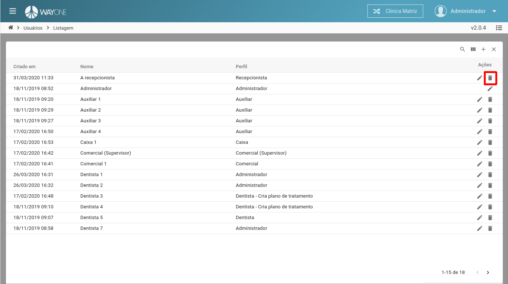
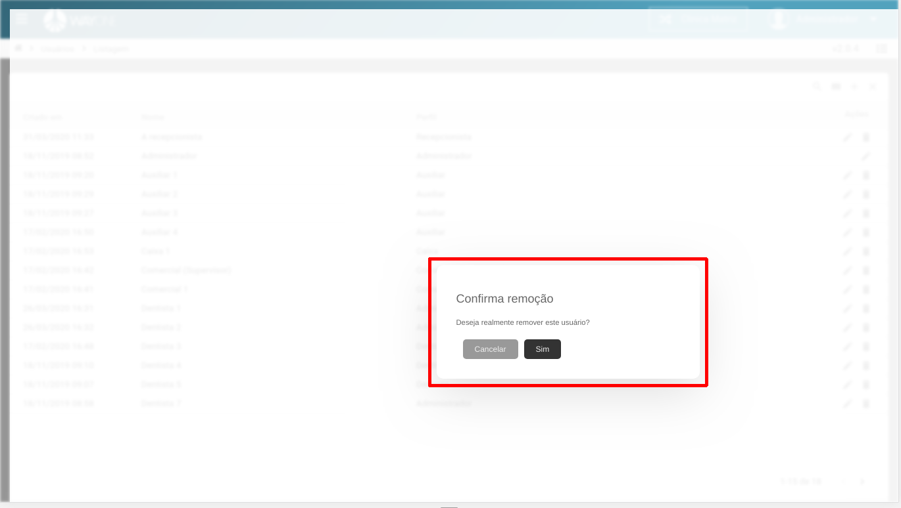

### Definição

Se tiver dúvidas sobre como pesquisar por um usuário, [clique aqui](/pages/usuario/como-pesquisar-por-um-usuario).

Após identificar na lista de usuários a que deseja remover, **clique** no **ícone da lixeira**.

  

Confirmando a remoção do usuário.

  

